# ROADMAP

Статус: active
Тип: repo-level planning doc
Последнее обновление: 2026-03-15

## Назначение

Этот документ фиксирует текущую карту открытого backlog на уровне репозитория:

- тематические кластеры задач;
- рекомендуемый порядок выполнения кластеров;
- жесткие зависимости между issue;
- мягкие зависимости, которые полезны для планирования, но пока не оформлены
  как GitHub-native `blocked by` или `sub-issue`.

`ROADMAP.md` не заменяет SSOT, feature-документы, ADR и issue-level планы
реализации. Он служит входной точкой для планирования порядка работ по открытому
backlog и должен синхронизироваться с GitHub Project и milestone-разметкой.

## Как читать этот документ

- GitHub Project остается источником истины по текущему lifecycle-статусу issue.
- GitHub-native `blocked by` и `parent/sub-issue` считаются каноническими для
  жестких зависимостей.
- `ROADMAP.md` собирает эти зависимости в одну планировочную картину и
  дополняет ее мягкими связями, которые пока не стоит кодировать нативно.

## Кластеры

### 1. Security и verification

Milestone: `Кластер: Security и verification`

- [#38](https://github.com/dapi/ai-teamlead/issues/38) —
  специфицировать платформу integration-тестирования agent flow в изолированном
  sandbox
- [#56](https://github.com/dapi/ai-teamlead/issues/56) —
  security review для безопасного использования в публичных репозиториях

### 2. Run/Poll semantics

Milestone: `Кластер: Run/Poll semantics`

- [#11](https://github.com/dapi/ai-teamlead/issues/11) —
  улучшить обработку issue вне проекта или с неожиданным статусом
- [#14](https://github.com/dapi/ai-teamlead/issues/14) —
  фильтрация задач по assignee текущего пользователя
- [#20](https://github.com/dapi/ai-teamlead/issues/20) —
  поддержка типа задачи `task`
- [#21](https://github.com/dapi/ai-teamlead/issues/21) —
  preflight-нормализация issue перед `run`
- [#67](https://github.com/dapi/ai-teamlead/issues/67) —
  dependency-aware lifecycle для связанных GitHub issues

### 3. Launch orchestration и multiplexer

Milestone: `Кластер: Launch orchestration и multiplexer`

- [#7](https://github.com/dapi/ai-teamlead/issues/7) —
  поддержка `tmux` как альтернативного мультиплексора
- [#13](https://github.com/dapi/ai-teamlead/issues/13) —
  выбор между новой вкладкой и панелью для запуска агента
- [#36](https://github.com/dapi/ai-teamlead/issues/36) —
  per-agent global args для launcher path
- [#47](https://github.com/dapi/ai-teamlead/issues/47) —
  configurable launch target defaults и CLI override
- [#49](https://github.com/dapi/ai-teamlead/issues/49) —
  issue-aware tab naming для `launch_target = tab`

### 4. Session recovery и re-entry

Milestone: `Кластер: Session recovery и re-entry`

- [#4](https://github.com/dapi/ai-teamlead/issues/4) —
  восстановление agent session по `session_uuid`
- [#18](https://github.com/dapi/ai-teamlead/issues/18) —
  поведение `run` при повторном запуске уже проработанной issue
- [#25](https://github.com/dapi/ai-teamlead/issues/25) —
  восстановление существующей агентской сессии в новой `zellij`-панели
- [#68](https://github.com/dapi/ai-teamlead/issues/68) —
  reuse live `pane/tab` при повторном `run`

### 5. Implementation lifecycle

Milestone: `Кластер: Implementation lifecycle`

- [#51](https://github.com/dapi/ai-teamlead/issues/51) —
  post-merge lifecycle после merge implementation PR
- [#65](https://github.com/dapi/ai-teamlead/issues/65) —
  flow автоподхвата PR review feedback и доведения implementation до
  `merged/closed`
- [#66](https://github.com/dapi/ai-teamlead/issues/66) —
  одна issue -> одна git-flow branch и один PR

### 6. Repo init и bootstrap

Milestone: `Кластер: Repo init и bootstrap`

- [#6](https://github.com/dapi/ai-teamlead/issues/6) —
  `init --force` и `init --clean`
- [#10](https://github.com/dapi/ai-teamlead/issues/10) —
  bootstrap GitHub Project и запись `project_id` в `settings.yml`

### 7. Release и user docs

Milestone: `Кластер: Release и user docs`

- [#8](https://github.com/dapi/ai-teamlead/issues/8) —
  релизный flow и install path
- [#9](https://github.com/dapi/ai-teamlead/issues/9) —
  user-facing README

## Рекомендуемый порядок выполнения

### Порядок кластеров

1. `Security и verification`
2. `Run/Poll semantics`
3. `Launch orchestration и multiplexer`
4. `Session recovery и re-entry`
5. `Implementation lifecycle`
6. `Repo init и bootstrap`
7. `Release и user docs`

### Ключевые внутренние цепочки

- [#13](https://github.com/dapi/ai-teamlead/issues/13) ->
  [#47](https://github.com/dapi/ai-teamlead/issues/47) ->
  [#49](https://github.com/dapi/ai-teamlead/issues/49)
- [#66](https://github.com/dapi/ai-teamlead/issues/66) ->
  [#65](https://github.com/dapi/ai-teamlead/issues/65) ->
  [#51](https://github.com/dapi/ai-teamlead/issues/51)
- [#4](https://github.com/dapi/ai-teamlead/issues/4) ->
  [#25](https://github.com/dapi/ai-teamlead/issues/25)

## Жесткий dependency graph

Ниже перечислены только связи, которые уже оформлены в GitHub-native виде или
достаточно однозначны для управления порядком работ.

```mermaid
flowchart TD
  subgraph RunPoll["Run/Poll semantics"]
    I11["#11 run: unexpected status handling"]
    I14["#14 poll: assignee filter"]
  end

  subgraph Launch["Launch orchestration и multiplexer"]
    I13["#13 launch target pane/tab"]
    I47["#47 config + CLI override"]
    I49["#49 issue-aware tab naming"]
  end

  subgraph Recovery["Session recovery и re-entry"]
    I4["#4 session recovery by session_uuid"]
    I25["#25 restore existing session in new pane"]
  end

  subgraph Impl["Implementation lifecycle"]
    I66["#66 one branch / one PR"]
    I65["#65 review feedback to merged/closed"]
    I51["#51 post-merge lifecycle"]
  end

  I11 -->|"sub-issue / blocks"| I14
  I13 -->|"blocks"| I47
  I47 -->|"blocks"| I49
  I4 -->|"sub-issue"| I25
  I66 -->|"blocks"| I65
  I65 -->|"sub-issue"| I51
```

## Мягкие связи

Эти связи полезны для планирования, но пока не оформлены как native dependency.

| Issue | Мягкая связь | Почему пока не кодируется нативно |
| --- | --- | --- |
| [#18](https://github.com/dapi/ai-teamlead/issues/18) | связана с [#4](https://github.com/dapi/ai-teamlead/issues/4) и [#11](https://github.com/dapi/ai-teamlead/issues/11) | задача шире простого session recovery и включает operator policy |
| [#68](https://github.com/dapi/ai-teamlead/issues/68) | связана с [#47](https://github.com/dapi/ai-teamlead/issues/47) и кластером recovery | это отдельный re-entry contract, а не прямой дочерний шаг launch-target work |
| [#21](https://github.com/dapi/ai-teamlead/issues/21) | тесно связана с [#14](https://github.com/dapi/ai-teamlead/issues/14) | ближе к sibling/follow-up, чем к sub-issue |
| [#9](https://github.com/dapi/ai-teamlead/issues/9) | зависит от зрелости [#8](https://github.com/dapi/ai-teamlead/issues/8), частично от [#7](https://github.com/dapi/ai-teamlead/issues/7) | README можно улучшать итеративно, без жесткой блокировки |
| [#38](https://github.com/dapi/ai-teamlead/issues/38) | является enabling work для runtime/zellij-фич | это инфраструктурный enabler сразу для нескольких кластеров |
| [#56](https://github.com/dapi/ai-teamlead/issues/56) | влияет на release/onboarding/public repo adoption | это cross-cutting security baseline, а не локальный blocker одной issue |

## Связь с GitHub Project

- Тематическая группировка backlog отражается через milestones.
- Lifecycle-статусы отражаются через поле `Status` в GitHub Project.
- Для визуального просмотра зависимостей и иерархии рекомендуется отдельный
  `Table view`, сгруппированный по `Milestone` и показывающий поля
  `Parent issue` и `Sub-issues progress`.
- GitHub Projects на текущем этапе не дает нативного graph-view для dependency
  edges `blocked by / blocking`, поэтому Mermaid-граф выше остается repo-local
  planning representation.

## Правила обновления roadmap

- новые жесткие зависимости сначала проверяются по issue body, acceptance
  criteria и существующим native links;
- `sub-issue` используется только для реальной декомпозиции parent-задачи;
- `blocked by` используется только для связи, без которой child-задача не может
  корректно перейти к реализации;
- мягкие связи добавляются в этот документ, если они важны для порядка работ,
  но пока недостаточно однозначны для GitHub-native кодирования;
- при изменении milestone-кластеров, жестких зависимостей или рекомендуемого
  порядка выполнения `ROADMAP.md` должен обновляться одновременно с GitHub
  разметкой.
